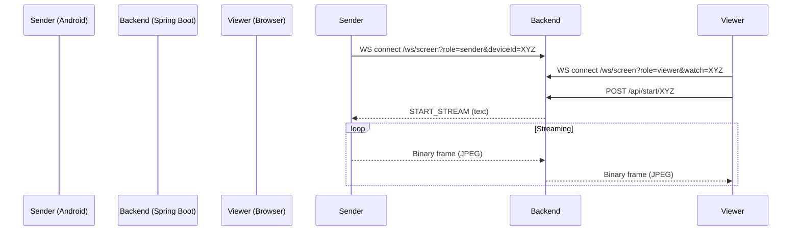

# 📡 Let’s Share — Screen Sharing Backend & Web Viewer

A **Kotlin + Spring Boot** backend for **real-time Android screen viewing**, plus a simple **browser viewer** (HTML + JS).

Android devices connect as **senders** over WebSocket and push **JPEG frames**. A browser connects as a **viewer** and renders frames onto a `<canvas>` in real time.

---

## ✨ Features

- 📱 **Device registry API** (`/api/register`, `/api/devices`)
- 🧷 **In-memory device tracking** with online/streaming status
- 🔌 **Raw WebSocket** endpoint (`/ws/screen`) — no STOMP
- 🎬 **Start command**: backend → device (`START_STREAM`)
- 🖥️ **Web viewer** (`viewer.html`) to pick a device and watch live

---

## 🧭 Architecture (high-level)

